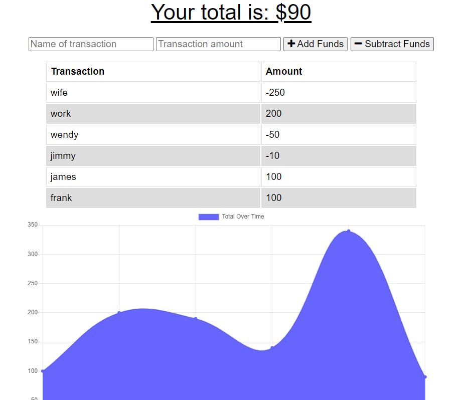

# 

  # 18-Online/Offline budget tracker

 ## Description 

 A budget tracker that remembers transations and graphs a flowing respresentation of current money per transaction. It has the capacity to take in data offline and have that data pushed once back online.
 
 ---
| Table of Contents |
|---|
| [Installation](#Installation) |
| [Usage](#Usage) |
| [License](#License) |
| [Contributions](#Contributions) |
| [Screenshot](#Screenshot) |
| [Questions](#Questions) |
---

## Installation 

download the package and npm i to install all dependencies

## Usage 

once all installed npm start in root directory and go to hosted webpage (usually on port 3000)

## License 

## Contributions 

N/a

## Screenshot 

## Questions
* You can contact us via email
* Github Username - ITLenardL
* Github Profile - https://github.com/ITLenardL
* Email - IT.LenardL@gmail.com 
